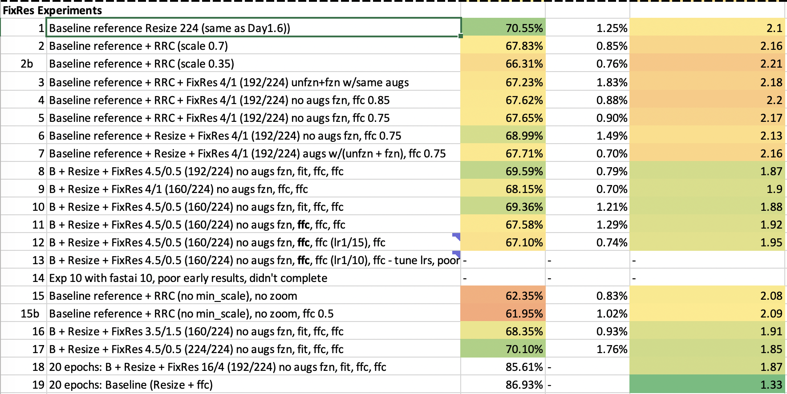

# FastGarden
FastGarden submissions, a fun fastai comp: https://forums.fast.ai/t/fastgarden-a-new-imagenette-like-competition-just-for-fun

## Results
Top result so far: 
- **71.24%	±1.24%, final loss: 2.06**
    - See experiment `15b` in `baseline_mcg.ipynb` for code and results
    - Used progressive resizing; 2e at 128, 3e at 224 
    - LR Schedule: flat lr of 1e-2 (.fit) for 128, flat to cosine decay with 1e-2 lr(.fit_flas_cos) for 224
    

### 2020-04-07: Day 1
17 experiments around xresnet50 with Mish and Ranger: lr tuning, training schedules and progressive resizing

### 2020-04-10: FixRes Experiments
19 Experiments based on the [FixRes training technique](https://arxiv.org/pdf/1906.06423.pdf), used in the current (April 2020) top performing ImageNet submission. 

The idea is that training CNNs at a lower resolution than your test resolution can give better results. When training with the same resolution as the test set, the apparent size of objects in the train set will appear larger than in the test set, at least if you are using a transform like RandomResizedCrop. They address this by:

1. Training at a lower resolution, e.g. train at 160, test at 224
2. Fine-tune the classifier layer at the test image resolution

In these 5epoch tests with FastGarden I didn't see any improvement over a standard baseline. Probably FixRes does not work in these cases where we have very few epochs?

