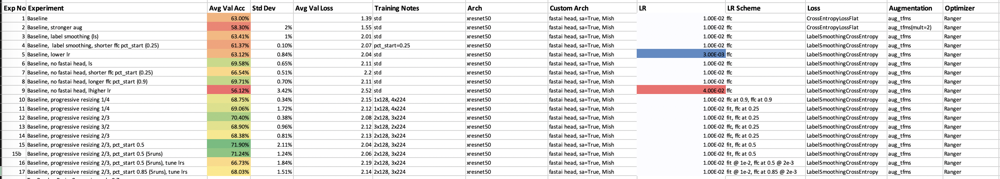

# fastgarden
FastGarden submissions, a fun fastai comp: https://forums.fast.ai/t/fastgarden-a-new-imagenette-like-competition-just-for-fun

## Results
Top result so far: 
- **71.24%	±1.24%, final loss: 2.06**
    - Progressive resizing, 2e at 128, 3e at 224 
    - flat lr of 1e-2(.fit) for 128, flat to cosine decay with 1e-2 lr(.fit_flas_cos) for 224
    

### Day 1
17 experiments around xresnet50 with Mish and Ranger: lr tuning, training schedules and progressive resizing

